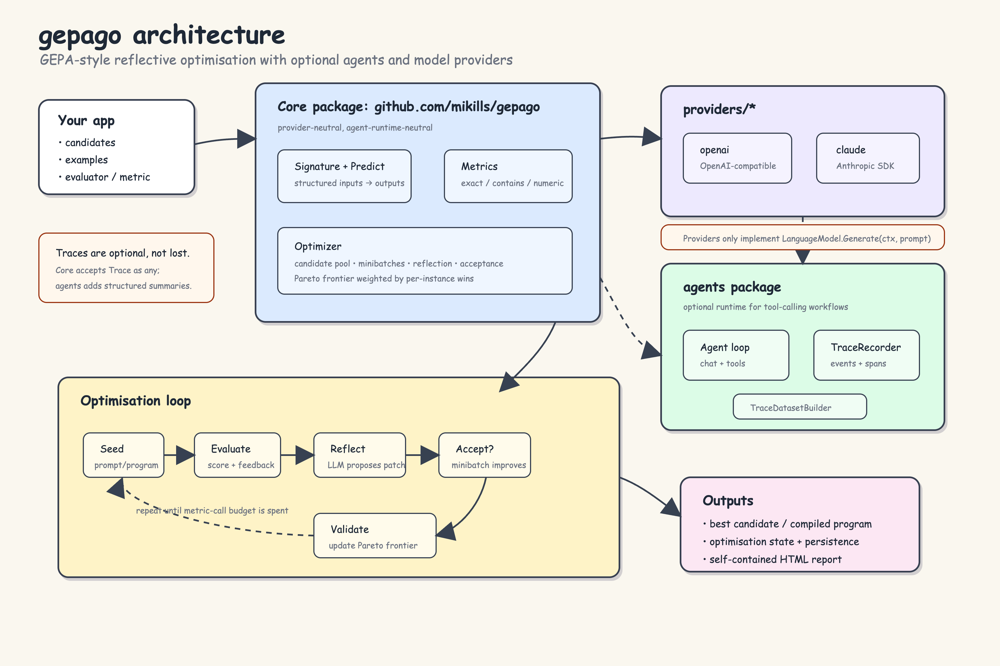

# gepago

`gepago` is a Go SDK for GEPA-style reflective optimisation.
It helps you improve prompts, policies, tool descriptions, and other text components
using evaluation feedback, with optional agent traces and model providers.

Original paper:
[GEPA: Reflective Prompt Evolution Can Outperform Reinforcement Learning](https://arxiv.org/abs/2507.19457).



## What it can do

- Run optional agent loops from the composable `agents` package.
- Emit full agent trace events for runs, turns, LLM calls, tool calls, errors, and run completion.
- Track usage with spans and ledgers instead of relying only on turn counts.
- Persist traces, run results, optimisation events, and optimiser state to files.
- Define signatures with named input/output fields for task-shaped LLM programmes.
- Run prompt-backed `Predict` programmes against structured inputs.
- Optimise named text candidates such as prompts, tool descriptions, routing rules, and policies.
- Load parsed text documents into examples for extraction-focused optimisation.
- Build reflective datasets from evaluation feedback and optional agent traces.
- Use built-in exact-match, contains, numeric, classification, and LLM judge metrics.
- Compile a `Predict`, `ChainOfThought`, or sequential `PipelineProgram` from examples, a metric, and a reflection model.
- Use a reflective LLM proposer to generate improved candidate text.
- Select candidates from a Pareto frontier or current-best strategy.
- Accept/reject candidates using configurable score criteria.
- Resume optimisation from persisted state.
- Use optional OpenAI or Claude providers for real reflective proposals.
- Generate a self-contained HTML report for candidates, proposals, scores, and usage spans.

## Package layout

```text
github.com/mikills/gepago                  core optimiser and programme layer
github.com/mikills/gepago/agents           optional evented agent runtime
github.com/mikills/gepago/providers/openai OpenAI and OpenAI-compatible provider
github.com/mikills/gepago/providers/claude Anthropic Claude provider
```

The root package is intentionally provider-neutral and does not depend on the agent runtime.
Use subpackages only for the integrations you need.

## Core flow

GEPA optimises text, not model weights. You provide a candidate text bundle, evaluation cases, and feedback. The optimiser turns failures into reflection records, asks a model for a patch, evaluates the patch, and keeps useful candidates on a frontier.

```text
Candidate text -> rollout/evaluate -> feedback/traces -> reflection -> patch -> frontier
```

## Programme layer

For common prompt-optimisation workflows, define a task signature, a `Predict` programme,
examples, and a metric:

```go
program := gepa.Predict{
    Signature: gepa.Signature{
        Name:    "sentiment",
        Inputs:  []gepa.Field{{Name: "text"}},
        Outputs: []gepa.Field{{Name: "label"}},
    },
    Instruction: "Classify the sentiment.",
    LM:          lm,
}

examples := []gepa.Example{
    gepa.NewIOExample(
        "positive-service",
        gepa.Prediction{"text": "I loved the fast service."},
        gepa.Prediction{"label": "positive"},
    ),
    gepa.NewIOExample(
        "negative-quality",
        gepa.Prediction{"text": "The product broke immediately."},
        gepa.Prediction{"label": "negative"},
    ),
}

split, err := gepa.SplitExamples(examples, gepa.SplitConfig{ValidationSize: 1, Shuffle: true, Seed: 1})
if err != nil {
    // handle error
}

config := gepa.DefaultCompileConfig(
    program,
    split.Train,
    split.Validation,
    gepa.ExactMatchMetric{Fields: []string{"label"}},
    lm,
)
compiled, state, err := gepa.Compile(ctx, config)
```

Use `ChainOfThought` when the programme should expose a concise reasoning field.
Use `DemosFromExamples` and the `demos` component when you want examples optimised with the instruction.
Use `LLMJudgeMetric` when exact labels are too rigid for the task.

For multi-step workflows, compose programmes with `PipelineProgram`. Each step has its own scoped components such as `extract.instruction` and `decide.instruction`, so GEPA can improve the steps independently while `Compile` still sees one programme.

```go
extractProgram := gepa.Predict{
    Signature: gepa.Signature{
        Name:    "extract_obligation",
        Inputs:  []gepa.Field{{Name: "document"}},
        Outputs: []gepa.Field{{Name: "amount"}, {Name: "deadline"}},
    },
    Instruction: "Extract the obligation amount and deadline.",
    LM:          lm,
}

decideProgram := gepa.Predict{
    Signature: gepa.Signature{
        Name:    "underwriting_decision",
        Inputs:  []gepa.Field{{Name: "amount"}, {Name: "deadline"}},
        Outputs: []gepa.Field{{Name: "decision"}, {Name: "reason"}},
    },
    Instruction: "Decide whether this obligation can be approved automatically.",
    LM:          lm,
}

program := gepa.PipelineProgram{
    Steps: []gepa.PipelineStep{
        {Name: "extract", Program: extractProgram},
        {Name: "decide", Program: decideProgram, InputKeys: []string{"amount", "deadline"}},
    },
}
```

This mirrors the GEPA paper's compound-system formulation `Φ = (M, C, X, Y)`: `PipelineProgram` is `Φ`, each `PipelineStep` is a language module `Mᵢ`, each child `Predict` carries the prompt and local input/output schema `(πᵢ, Xᵢ, Yᵢ)`, and the ordered pipeline is the control flow `C`.

## Reusable programme artifacts

Optimisation can happen offline, then runtime applications can load the trained prompt bundle wherever the same programme can be initialised.

```go
artifact := gepa.NewProgramArtifact("financial-scout", compiled.Candidate)
err := gepa.SaveProgramArtifact("financial-scout.program.json", artifact)
```

At runtime, register factories that inject app dependencies such as models, tools, stores, or retrievers:

```go
registry := gepa.NewProgramRegistry()
err := registry.Register("financial-scout", func() (gepa.Program, error) {
    return buildFinancialScoutProgram(plannerLM, reporterLM, retriever), nil
})

compiled, artifact, err := registry.LoadCompiled("financial-scout.program.json")
result, err := compiled.Run(ctx, input)
_ = artifact
```

Services may also train on demand, then reuse the saved artifact on later calls:

```go
compiled, artifact, state, trained, err := registry.LoadOrTrain(ctx, gepa.ProgramTrainConfig{
    Name:           "financial-scout",
    ArtifactPath:   "financial-scout.program.json",
    ProgramVersion: "v1",
    Trainset:       examples,
    Metric:         metric,
    ReflectionLM:   reflectorLM,
    MaxMetricCalls: 8,
})
result, err := compiled.Run(ctx, input)
_, _, _ = artifact, state, trained
```

This separates reusable programme shape from trained candidate text. The artifact chooses the programme by name; the registry supplies the runtime dependencies. Use `LoadCompiledVersion` for reviewed production artifacts and `LoadOrTrain` when a service is allowed to bootstrap or refresh a programme at runtime. `ProgramVersion` lets the app reject stale artifacts when the programme shape changes.

For service-style deployments, reusable programme families can implement `ProgramTemplate` and be registered with `RegisterTemplate`. GEPAgo also includes helpers for JSONL training data (`LoadJSONLExamples`), artifact indexes (`WriteProgramArtifactManifest`), before/after prompt reports (`WriteCandidateDiffReport`), a minimal HTTP runner (`ProgramHTTPHandler`), and cross-process runtime-training locks (`FileTrainLock`, `LoadOrTrainLocked`).

Lower-level optimiser APIs remain available when you need full control.

## Key extension points

- `Evaluator`: scores candidates against examples.
- `ReflectiveDatasetBuilder`: turns outputs, feedback, and traces into reflection records.
- `Proposer`: creates candidate patches.
- `LanguageModel`: provider-neutral reflection model interface.
- `CandidateSelector`: chooses the next parent candidate.
- `ComponentSelector`: chooses which text components to update.
- `AcceptanceCriterion`: decides whether a proposal is kept.
- `OptimizationPersistence`: stores and loads optimiser state.

## Visual report

```go
compiled, state, err := gepa.CompileAndReport(ctx, config, "report.html", gepa.HTMLReportOptions{})
```

For lower-level optimiser use:

```go
state, err := optimizer.Run(ctx)
if err != nil {
    // handle error
}
err = gepa.WriteHTMLReport("report.html", state, gepa.HTMLReportOptions{})
```

The report is a single HTML file you can open in a browser.

## Role-based model routing

Use `ModelRouter` when a programme should spend stronger models on planning, reflection, or judging while using cheaper models for constrained task execution.

```go
router := gepa.ModelRouter{Default: taskLM}.
    With(gepa.RoleReflector, strongLM).
    With(gepa.RoleJudge, strongLM).
    With(gepa.RoleImplementer, cheapLM)

proposer := gepa.ReflectiveProposer{LM: router.For(gepa.RoleReflector)}
judge := gepa.LLMJudgeMetric{LM: router.For(gepa.RoleJudge), Rubric: "..."}
```

## Reflection traces

GEPA reflection does not require an agent runtime. Simple prompt or programme optimisation can use scores plus ordinary LLM call metadata:

```text
prompt -> completion -> score -> reflection -> improved candidate
```

Use `agents/` when the task itself is a tool-using workflow and you want richer execution traces:

```text
agent run -> turns -> LLM calls -> tool calls -> observations -> score -> reflection
```

So simple tasks may only need LLM call traces and scores. Tool-using workflows benefit from full agent traces.

## Agents

Agent runtime types live outside the core package:

```go
import gepaagents "github.com/mikills/gepago/agents"
```

Use this package when you need tool-calling loops, memory, observers, traces,
or agent-trace-backed reflection. The core optimiser remains independent of the agent runtime.

```go
recorder := gepaagents.NewTraceRecorder()
agent := gepaagents.Agent{
    Name:      "researcher",
    Client:    chatClient,
    Model:     "model-name",
    Observers: []gepaagents.Observer{recorder},
}
```

## Providers

Provider packages live outside the core package:

```go
import (
    gepaclaude "github.com/mikills/gepago/providers/claude"
    gepaopenai "github.com/mikills/gepago/providers/openai"
)
```

Each provider implements the core `LanguageModel` interface:

```go
lm, err := gepaopenai.NewLanguageModel(gepaopenai.Config{
    APIKey: os.Getenv("OPENAI_API_KEY"),
    Model:  "gpt-4.1-mini",
})
```

OpenAI-compatible endpoints can use `BaseURL` and provider-specific headers:

```go
lm, err := gepaopenai.NewLanguageModel(gepaopenai.Config{
    BaseURL: "https://openai-compatible.example.com/v1",
    Model:   "provider-model",
    Headers: map[string]string{
        "Authorization": "Bearer " + os.Getenv("PROVIDER_API_KEY"),
        "X-Route":       "default",
    },
})
```

```go
lm, err := gepaclaude.NewLanguageModel(gepaclaude.Config{
    APIKey: os.Getenv("ANTHROPIC_API_KEY"),
    Model:  "claude-sonnet-4-20250514",
})
```

## Examples

Run the deterministic example without API keys:

```bash
go run ./examples/deterministic
```

Run the sentiment prompt optimisation example with OpenAI:

```bash
OPENAI_API_KEY=... go run ./examples/sentiment
```

Or with Claude:

```bash
GEPA_PROVIDER=claude ANTHROPIC_API_KEY=... go run ./examples/sentiment
```

It writes `sentiment-report.html` in the current directory.

## Development

Run the full local suite:

```bash
make verify
```

If `diago` is not installed, run the standard checks:

```bash
make fmt
make test
make vet
make staticcheck
```

See [CONTRIBUTING.md](CONTRIBUTING.md) for contribution and provider E2E notes.

## Provider E2E

Provider E2E tests are opt-in so normal `go test ./...` does not spend API credits.

If `OPENAI_API_KEY` is set, run:

```bash
go test -tags=e2e ./providers/openai -run TestOptimizerE2E -count=1 -v
```

The test starts with a weak support-ticket triage instruction, uses OpenAI to propose a stronger one,
evaluates it, and accepts it when the score improves.

If `ANTHROPIC_API_KEY` or `CLAUDE_API_KEY` is set, run:

```bash
go test -tags=e2e ./providers/claude -run TestProposerE2E -count=1 -v
```

## License

MIT. See [LICENSE](LICENSE).
